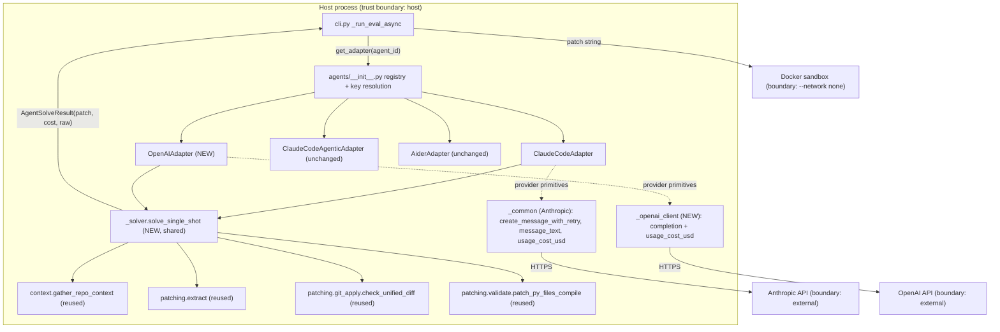

# PLAN.md — v0.2 "Second agent adapter + hardening"

> In-place enhancement of an existing, **green** Python project
> (`coding-agent-eval-harness`). This is NOT greenfield. Read
> [CODEBASE.md](CODEBASE.md) and [ASSUMPTIONS.md](ASSUMPTIONS.md) first — they
> hold the architecture map, the green-baseline verdict (`173 passed, 93.14%
> coverage, ruff + mypy --strict clean`), the landmines, and the agreed scope.
> This plan designs only the enhancement; it does not regenerate the project.
>
> Branch: `feat/openai-adapter-and-hardening` (never `main`).

---

## 1. Goal & non-goals

### Goal

Ship v0.2 so the harness has a **second, real, in-process agent adapter** and a
modestly **hardened** baseline, without disturbing any existing behavior:

1. **OpenAI single-shot adapter** (`agent_id = "openai"`) using the already-pinned
   `openai==1.53.0` dep, mirroring `ClaudeCodeAdapter`'s pipeline: gather repo
   context → build prompt → completion → extract unified patch → apply-check +
   py-compile validation → bounded retry with apply-failure context →
   format re-prompt fixup. Fully unit-testable with a **mocked** OpenAI client
   (no network) so it stays in the offline green baseline.
2. **DRY refactor** — lift the apply-check + format-fixup solve loop out of
   `claude_code.py` into a shared, provider-parameterized solver so both
   providers reuse it. Existing Claude adapter behavior must remain
   **byte-identical** (the 173-test suite + `test_claude_code.py` is the
   regression guard).
3. **Hardening** — (a) timezone-aware `created_at`; (b) a protective, documented
   `REGRESSION_TOLERANCE`; (c) remove vestigial deps (`langsmith`, `datasets`,
   `tree-sitter`) and the `datasets` mypy override — **keep `openai`**.
4. **Docs** — README agents table + comparison-narrative row,
   `docs/adding_agents.md` (OpenAI adapter as the worked example),
   `.env.example` (`OPENAI_API_KEY` already present; tidy LangSmith vars).

### Non-goals (deferred per [ASSUMPTIONS.md](ASSUMPTIONS.md); do not do in this scope)

- **D1 — Dataset 20 → 50 tasks.** Needs `GITHUB_TOKEN` + network re-run of
  `build-dataset`; data-gathering, not a code change.
- **D2 — Add `claude-code-agentic` (or `openai`) to the nightly workflow.**
  Introduces recurring API spend on a schedule; needs explicit money-spend
  approval. **Do not touch `leaderboard-nightly.yml`** (it pushes to `main` with
  `contents: write`).
- **D3 — Real OpenAI / cross-agent leaderboard numbers.** Needs `OPENAI_API_KEY`
  + a paid run (A3: no real API spend this round).
- **Out of scope by design:** changing the judge (stays Anthropic), the rubric,
  the sandbox, the agentic adapter's tool loop, `extract.py`, `context.py`
  budgets, `semantic.py` `CACHE_VERSION`, or the `ANN101` ruff no-op warning
  (cosmetic; leave it).

---

## 2. Measurable success criteria (objectively checkable, offline)

Each is verifiable with no network and no API keys. `N` below = current 173 plus
the new adapter's tests.

| # | Criterion | How to verify offline |
|---|---|---|
| S1 | Full suite green, no new warnings | `uv run pytest -q` → `N passed`, `N ≥ 173 + 6` (6+ new OpenAI tests, incl. the 2 mandatory cost tests + the empty-content test), `0 failed/errored`, **no `DeprecationWarning` for `datetime.utcnow`** |
| S2 | Coverage gate holds | `pytest` `--cov-fail-under=85` passes (agents/ stay coverage-omitted, so the bar is unchanged) |
| S3 | Lint clean | `uv run ruff check .` → no errors |
| S4 | Format clean | `uv run ruff format --check src scripts` → all formatted |
| S5 | Types clean | `uv run mypy --strict src` → 0 issues in all source files |
| S6 | OpenAI adapter registered + constructible | `"openai" in AGENT_REGISTRY`; `get_adapter("openai", api_key="x")` returns an `OpenAIAdapter`; `get_adapter("openai")` (no key) still constructs (key resolved from env, like Claude) |
| S7 | Key plumbing generalized | `get_adapter("openai")` reads `OPENAI_API_KEY`; `get_adapter("claude-code")` reads `ANTHROPIC_API_KEY` — neither requires the caller to know which env var |
| S8 | Existing Claude behavior unchanged | All 5 `test_claude_code.py` tests pass **unmodified**; all 6 `test_claude_code_agentic.py` pass unmodified; `test_agent_retry.py` passes |
| S9 | New adapter unit tests exist | `tests/test_openai_adapter.py` covers: happy path (1 call, patch applies), apply-check retry (bad→good, 2 calls), exhausted retries → empty patch (3 calls), format-reprompt (malformed→good, fixup logged), empty-content → empty patch (no crash) — all with a **mocked** OpenAI client |
| S10 | No vestigial deps remain | `langsmith`, `datasets`, `tree-sitter` absent from `pyproject.toml` `dependencies`; `datasets` removed from the mypy override; `openai` **retained**; `grep -r "langsmith\|tree_sitter\|import datasets\|from datasets" src` → no matches |
| S11 | No deprecated datetime | `grep -rn "datetime.utcnow" src` → no matches; `TaskResult.created_at` is timezone-aware (`tzinfo is not None`) |
| S12 | Regression gate is protective + documented | `REGRESSION_TOLERANCE` lowered to a value `< 0.60` with a comment justifying it; the gate still runs and skips deterministically when given an explicit non-existent baseline: `python scripts/ci_regression_gate.py /nonexistent/baseline.json results/leaderboard.json` exits 0 (prints "No baseline …; skipping regression gate") |
| S13 | Lockfile consistent | `uv lock --check` (or `uv sync`) succeeds after dep removal |
| S14 | Docs updated | README has an `openai` row in the agents table + comparison narrative; `docs/adding_agents.md` uses the OpenAI adapter as the worked example; `.env.example` documents `OPENAI_API_KEY` |
| S15 | Cost accounting is correct (regression-proof) | New mandatory cost tests in `tests/test_openai_adapter.py` pass: (a) single-call happy path asserts `result.cost_usd == (prompt_tokens*INPUT + completion_tokens*OUTPUT)/1e6` exactly; (b) a multi-call (retry) path asserts `result.cost_usd` equals the **sum** across all calls. See §7. |

**Success-criteria count: 15** (S1–S15). Every criterion is offline-verifiable
with no network and no API keys: S1–S5, S13 are tool runs; S6–S7, S11 are pure
in-process Python assertions; S8–S9, S15 are pytest assertions against mocked
clients; S10 is grep + file inspection; S12 is a deterministic exit-code check
with explicit args; S14 is file inspection. No criterion requires a live API.

---

## 3. Architecture & component design

### 3.1 Where this fits

The harness pipeline (clone → adapter.solve → apply-check → sandbox → rubric →
leaderboard) is unchanged. **The only structural change is inside
`agents/`**: a new provider and a shared solver seam. Everything downstream of
`AgentSolveResult` is untouched, plus three small isolated hardening edits.



**Trust boundaries (unchanged from CODEBASE.md §5):** adapters run host-side with
read-only repo access; patches are strings in memory; execution is in the sealed
Docker sandbox; API keys are env-only and never logged. The new OpenAI call sits
on the same external boundary as the Anthropic call, behind the same
retry/backoff discipline.

### 3.2 The shared solver seam

The solve loop in `claude_code.py` (lines 43–182: completion → extract → format
fixup → apply-check → bounded retry) is **provider-agnostic except for two
primitives**. Lift it into a new module, parameterized over exactly those two
seams so the loop body is shared verbatim.

**New module: `src/coding_eval/agents/_solver.py`**

```python
from __future__ import annotations

from typing import TYPE_CHECKING, Protocol

if TYPE_CHECKING:
    from collections.abc import Awaitable, Callable
    from coding_eval.agents.result import AgentSolveResult
    from coding_eval.dataset.schema import Task


class CompletionFn(Protocol):
    """Provider-specific: send the running message list, return one assistant turn.

    CONTRACT (one, unambiguous): the closure returns the **incremental** cost of
    *this single call only* — ``(assistant_text, incremental_cost_usd)`` — and
    MUST append the assistant's reply to ``messages`` (so the next turn sees it).
    The solver, NOT the closure, owns running-total accumulation: it sums each
    returned increment into its local ``cost`` and puts the final total on
    ``AgentSolveResult.cost_usd``.

    This is a DELIBERATE change from today's
    ``ClaudeCodeAdapter._append_completion``, which returns the **cumulative**
    ``cost + usage_cost_usd(...)``. Moving accumulation into the solver is a
    SEMANTIC change, not a mechanical lift — see §3.3 for the discipline that
    keeps the final total bit-for-bit identical to today.
    """
    async def __call__(self, messages: list[dict[str, str]]) -> tuple[str, float]: ...


async def solve_single_shot(
    *,
    task: Task,
    repo_path: str,
    complete: CompletionFn,
    max_apply_attempts: int = 3,
) -> AgentSolveResult: ...
```

The solver owns, verbatim from `claude_code.py`:

- `gather_repo_context(...)` (via `asyncio.to_thread`) and `_build_user_prompt`.
- The format-fixup helper (`extract_unified_patch` → if empty &
  `looks_like_diff_attempt`, re-prompt `FORMAT_REPROMPT` then
  `FORMAT_REPROMPT_STRICT`, then `fallback_raws`).
- `_validate_patch` (apply-check + py-compile via `asyncio.to_thread`).
- The bounded retry loop with `_build_retry_prompt` and the `raw_log`/cost
  bookkeeping, returning `AgentSolveResult`.

The **only thing it does not own** is *how a completion is produced* — that is
the `complete` callback each adapter passes in. Message dicts use the structural
shape `{"role": ..., "content": ...}`, which is what both SDKs accept for
single-shot text turns (Anthropic `MessageParam` and OpenAI
`ChatCompletionMessageParam` are both TypedDicts with `role`/`content`).

#### Cost-accumulation contract (the one semantic change in this refactor)

This is **not** a mechanical lift, and the plan treats it as the highest-risk
correctness item. Today `_append_completion` returns the running cumulative total
(`cost + usage_cost_usd(...)`) and every call site threads that total forward.
The shared solver inverts that: the closure returns **only this call's
increment**, and the solver does the summing. The two designs must produce an
**identical final `cost_usd`**.

**Decision (stated once, applied everywhere):** the closure returns the
incremental per-call cost; the solver sums. Every place that today added into the
running total becomes a `cost += increment` inside the solver. Enumerate every
accumulation point so none is missed — there are **up to four `complete` calls**
per `solve`, each contributing exactly one increment:

| # | Accumulation point (today, in `claude_code.py`) | Calls to `complete` | Solver bookkeeping |
|---|---|---|---|
| 1 | Initial completion (`_append_completion`, line 56) | 1 | `raw, inc = await complete(messages); cost += inc` |
| 2 | Format-fixup loop after the initial completion (`_extract_with_format_fixup`, line 168) — loops over `(FORMAT_REPROMPT, FORMAT_REPROMPT_STRICT)`, so up to **2** `complete` calls | 0–2 | each iteration: `fix_raw, inc = await complete(messages); cost += inc` |
| 3 | Each apply-retry completion (`_append_completion`, line 101) — once per retry, bounded by `MAX_APPLY_ATTEMPTS = 3` (so up to 2 retries → up to 2 calls) | 0–2 | `retry_raw, inc = await complete(messages); cost += inc` |
| 4 | Format-fixup loop after each retry completion (same helper, line 168, called with `fallback_raws=[retry_raw, raw]`) | 0–2 per retry | same `cost += inc` inside the shared fixup helper |

> **Refactor-discipline note (must hold):** after the lift, the solver's running
> `cost` total at every `return AgentSolveResult(...)` MUST equal what today's
> threading produces, i.e. the sum of `usage_cost_usd(...)` over exactly the same
> set of completions. Concretely: today's `cost = cost + usage_cost_usd(u_k)` for
> each call `k` is replaced by `cost += inc_k` where `inc_k =
> usage_cost_usd(u_k)`; the closure must therefore return
> `usage_cost_usd(message.usage)` (NOT `cost + usage_cost_usd(...)`). The format-
> fixup helper, which currently both receives and returns `cost`, is rewritten to
> mutate the solver's running total via the same `cost += inc` pattern so its
> increments are not dropped or double-counted. This invariant is locked by the
> mandatory cost tests in §7 (S15): a single-call test pins one increment, and a
> multi-call test pins the sum.

> **Refactor discipline (critical, behavioral):** the moved code is otherwise a
> **mechanical lift**, not a rewrite. Helper names, log event strings
> (`agent.apply_check_failed`, `agent.format_reprompt`,
> `agent.extract_fallback_raw`, etc.), prompt ordering, `MAX_APPLY_ATTEMPTS = 3`,
> the `"--- format fixup ---"` marker, and the exact `_join_raw_log` formatting
> are preserved so `test_claude_code.py` passes unmodified (it asserts
> `await_count` and the fixup marker — see S8/S9). The cost-accumulation seam
> above is the single deliberate semantic change, and it is the one behavior the
> existing suite does NOT guard (S15 adds that guard).

### 3.3 The Claude adapter after the refactor (thin)

`claude_code.py` keeps the class + its Anthropic `complete` closure and delegates
the loop to the solver. The closure conforms to the **incremental** contract
(§3.2): it returns `usage_cost_usd(message.usage)` for this one call only — NOT
the old cumulative `cost + usage_cost_usd(...)`. This is the visible diff from
today's `_append_completion`:

```python
class ClaudeCodeAdapter(AgentAdapter):
    agent_id = "claude-code"

    def __init__(self, api_key: str | None = None) -> None:
        self._client = anthropic.AsyncAnthropic(api_key=api_key)

    def name(self) -> str:
        return self.agent_id

    async def solve(self, task: Task, repo_path: str) -> AgentSolveResult:
        async def complete(messages: list[dict[str, str]]) -> tuple[str, float]:
            message = await create_message_with_retry(
                lambda: self._client.messages.create(
                    model=MODEL_ID, max_tokens=4096, temperature=0,
                    system=SYSTEM_PROMPT, messages=cast("Any", messages),
                ),
            )
            raw = message_text(message)
            messages.append({"role": "assistant", "content": raw})
            # INCREMENTAL: this call's cost only. The solver accumulates.
            # (Was `cost + usage_cost_usd(...)` cumulative; now just the delta.)
            return raw, usage_cost_usd(message.usage)

        return await solve_single_shot(
            task=task, repo_path=repo_path, complete=complete,
        )
```

`MAX_APPLY_ATTEMPTS` / `MODEL_ID` stay exported from `claude_code.py` (its
`__all__` is part of the public surface used by tests/CLI).

> **Scope boundary:** `claude_code_agentic.py` is **NOT refactored**. Its loop is
> tool-using and structurally different (tool_use blocks, forced-diff turns, cost
> ceiling); folding it into the single-shot solver would be a rewrite and risks
> its 6 tests. It keeps using `_common` directly. This is intentional — the
> shared solver covers single-shot only.

### 3.4 The new OpenAI adapter

**New module: `src/coding_eval/agents/openai_adapter.py`** (filename
`openai_adapter.py`, not `openai.py`, to avoid shadowing the `openai` package on
import).

```python
from __future__ import annotations

import openai

from coding_eval.agents._openai_client import (
    completion_text,
    create_completion_with_retry,
    usage_cost_usd,
)
from coding_eval.agents._solver import solve_single_shot
from coding_eval.agents.base import AgentAdapter
from coding_eval.agents.prompts import SYSTEM_PROMPT
from coding_eval.agents.result import AgentSolveResult
from coding_eval.dataset.schema import Task
from coding_eval.models import DEFAULT_OPENAI_MODEL

MODEL_ID = DEFAULT_OPENAI_MODEL


class OpenAIAdapter(AgentAdapter):
    agent_id = "openai"

    def __init__(self, api_key: str | None = None) -> None:
        self._client = openai.AsyncOpenAI(api_key=api_key)

    def name(self) -> str:
        return self.agent_id

    async def solve(self, task: Task, repo_path: str) -> AgentSolveResult:
        async def complete(messages: list[dict[str, str]]) -> tuple[str, float]:
            # OpenAI takes the system prompt as the first message, not a kwarg.
            payload = [{"role": "system", "content": SYSTEM_PROMPT}, *messages]
            response = await create_completion_with_retry(
                lambda: self._client.chat.completions.create(
                    model=MODEL_ID, temperature=0, max_tokens=4096,
                    messages=cast("Any", payload),
                ),
            )
            raw = completion_text(response)
            messages.append({"role": "assistant", "content": raw})
            # INCREMENTAL per the §3.2 contract: this call's cost only.
            return raw, usage_cost_usd(response.usage)

        return await solve_single_shot(
            task=task, repo_path=repo_path, complete=complete,
        )


__all__ = ["MODEL_ID", "OpenAIAdapter"]
```

Key provider differences handled in the closure (per discovery facts):

| Concern | Anthropic | OpenAI |
|---|---|---|
| System prompt | `system=` kwarg | first `{"role": "system"}` message |
| Call | `client.messages.create` | `client.chat.completions.create` |
| Text out | `message_text` (concat text blocks) | `choices[0].message.content` |
| Usage | `usage.input_tokens / output_tokens` | `usage.prompt_tokens / completion_tokens` |
| Retryable errors | `anthropic.RateLimitError / InternalServerError / APIConnectionError` | `openai.RateLimitError / InternalServerError / APIConnectionError` (+ `APITimeoutError`) |

### 3.5 OpenAI provider primitives

**New module: `src/coding_eval/agents/_openai_client.py`** — the OpenAI mirror of
`_common.py` (kept separate so `_common.py`'s Anthropic types/imports are
untouched and the existing import graph is stable).

```python
from __future__ import annotations

import asyncio
from typing import TYPE_CHECKING

import openai
import structlog
from openai.types.chat import ChatCompletion

if TYPE_CHECKING:
    from collections.abc import Awaitable, Callable

log = structlog.get_logger(__name__)

# gpt-4o pricing (USD per million tokens). If DEFAULT_OPENAI_MODEL changes,
# update BOTH constants here and the model id in models.py (see A4).
INPUT_USD_PER_MTOK = 2.5
OUTPUT_USD_PER_MTOK = 10.0

MAX_RETRIES = 4
RETRY_BASE_DELAY_S = 1.0
_RETRYABLE_ERRORS = (
    openai.RateLimitError,        # 429
    openai.InternalServerError,   # >=500
    openai.APIConnectionError,    # network drop
    openai.APITimeoutError,       # request timeout
)


def usage_cost_usd(usage: object) -> float:
    # Returns the INCREMENTAL cost for one completion (per the §3.2 contract).
    if usage is None:
        return 0.0
    prompt = getattr(usage, "prompt_tokens", 0) or 0
    completion = getattr(usage, "completion_tokens", 0) or 0
    return (prompt * INPUT_USD_PER_MTOK + completion * OUTPUT_USD_PER_MTOK) / 1_000_000


def completion_text(response: ChatCompletion) -> str:
    if not response.choices:
        return ""
    return response.choices[0].message.content or ""


async def create_completion_with_retry(
    make_call: Callable[[], Awaitable[ChatCompletion]],
) -> ChatCompletion:
    """Mirror of _common.create_message_with_retry for the OpenAI SDK."""
    delay = RETRY_BASE_DELAY_S
    for attempt in range(MAX_RETRIES):
        try:
            return await make_call()
        except _RETRYABLE_ERRORS as exc:
            log.warning(
                "openai.retry", attempt=attempt + 1, max_retries=MAX_RETRIES,
                error=type(exc).__name__, delay_s=delay,
            )
            await asyncio.sleep(delay)
            delay *= 2
    return await make_call()
```

> `usage_cost_usd` is typed `object` + `getattr` defensively because mocked
> `usage` in tests is a `MagicMock`; the real type is `CompletionUsage`. This is
> consistent with how the Claude tests pass `MagicMock(input_tokens=...,
> output_tokens=...)`. `completion_text` guards empty `choices` (real-world 5xx
> bodies / refusals) so the solver's empty-patch path is exercised cleanly — and
> that degrade-to-empty-patch behavior is explicitly tested (§7, the
> empty-content test) rather than merely asserted.

### 3.6 Registry & key plumbing generalization

Today `get_adapter` always receives `ANTHROPIC_API_KEY` from `cli.py` (cli.py:264)
and decides via `_API_KEY_AGENTS` whether to pass it. OpenAI needs a **different**
env var, and the caller should not have to know which. Generalize to a
**per-adapter "needs key from env X"** map and resolve inside `get_adapter`.

**`src/coding_eval/agents/__init__.py`** (new shape):

```python
import os                       # NEW: required by env-resolving get_adapter (was not imported)

from .openai_adapter import OpenAIAdapter   # NEW import

AGENT_REGISTRY: dict[str, type[AgentAdapter]] = {
    "claude-code": ClaudeCodeAdapter,
    "claude-code-agentic": ClaudeCodeAgenticAdapter,
    "aider": AiderAdapter,
    "openai": OpenAIAdapter,
}

# Adapters that take an api_key kwarg, and the env var each resolves it from.
_API_KEY_ENV: dict[str, str] = {
    "claude-code": "ANTHROPIC_API_KEY",
    "claude-code-agentic": "ANTHROPIC_API_KEY",
    "openai": "OPENAI_API_KEY",
}


def get_adapter(agent_id: str, *, api_key: str | None = None) -> AgentAdapter:
    adapter_cls = AGENT_REGISTRY.get(agent_id)
    if adapter_cls is None:
        supported = ", ".join(sorted(AGENT_REGISTRY))
        raise ValueError(f"Unknown agent {agent_id!r}; supported: {supported}")
    env_var = _API_KEY_ENV.get(agent_id)
    if env_var is None:
        return adapter_cls()
    # Explicit api_key wins (test injection); else resolve from the adapter's env var.
    key = api_key if api_key is not None else os.environ.get(env_var)
    return cast("type[ClaudeCodeAdapter]", adapter_cls)(api_key=key)
```

**Edit-completeness note (defect-driven):** the current `agents/__init__.py` does
**not** `import os`; the env-resolving `get_adapter` above calls
`os.environ.get`, so the change set MUST include **`+ import os`** at module top
(alphabetical with the existing stdlib imports). Without it the module fails to
import. This is also reflected in §3.9's edit annotation.

**Backward-compat note (preserves S7/S8):**
- `get_adapter("claude-code", api_key="x")` still passes `"x"` — unchanged.
- `cli.py:264` currently calls `get_adapter(agent_id, api_key=os.environ.get("ANTHROPIC_API_KEY"))`.
  With OpenAI in the mix, passing the Anthropic key to the OpenAI adapter would be
  wrong. **Fix cli.py to call `get_adapter(agent_id)` and let the registry resolve
  the right env var per adapter.** This is the minimal, correct change. (The
  Anthropic client used by the semantic judge at cli.py:255–257 is separate and
  stays as-is.)
- `_API_KEY_ENV` replaces `_API_KEY_AGENTS`; `frozenset` membership becomes dict
  membership. No public name other than `get_adapter`/`AGENT_REGISTRY` is removed
  (the old `_ADAPTERS` alias and `_API_KEY_AGENTS` are private).

### 3.7 Models & pricing

**`src/coding_eval/models.py`** — add an OpenAI default, judge stays Anthropic:

```python
# OpenAI default for the openai adapter (temperature=0 in caller). Pinned snapshot
# for reproducibility; swappable via env/override. Pricing lives in
# agents/_openai_client.py and MUST move with this id (A4).
GPT_4O = "gpt-4o-2024-11-20"
DEFAULT_OPENAI_MODEL = GPT_4O
```

`DEFAULT_AGENT_MODEL` / `DEFAULT_JUDGE_MODEL` are unchanged (judge stays
Anthropic Sonnet 4.5). Add `GPT_4O`, `DEFAULT_OPENAI_MODEL` to `__all__`.

> Version check: `gpt-4o-2024-11-20` is the current dated `gpt-4o` snapshot and is
> served by the stable `openai` 1.x line (1.53.0 included). Reproducibility comes
> from pinning the snapshot, not the specific choice (A1). Pricing 2.50/10.00 per
> MTOK matches the published `gpt-4o` rate; documented next to the constants (A4).

### 3.8 Hardening edits (small, isolated)

**(a) `dataset/schema.py` — timezone-aware `created_at`:**

```python
from datetime import UTC, datetime
...
    created_at: datetime = Field(default_factory=lambda: datetime.now(UTC))
```

Removes the Python 3.12 `DeprecationWarning` (S11). `datetime` value is still
serialized by pydantic the same way; existing `TaskResult` round-trip tests in
`test_dataset.py` / `test_io.py` continue to pass (they don't assert tzinfo).

**(b) `scripts/ci_regression_gate.py` — protective tolerance:**

Lower `REGRESSION_TOLERANCE` from `0.60` to **`0.10`** with a justifying comment.
Current max composite is ~0.60 and run-to-run sampling variance is noted as ~0.2
in the README — but `temperature=0` makes per-task variance small; the gate
compares **mean** composite over the smoke set, which is far more stable.
`0.10` catches a real regression (a ~17% relative drop at composite 0.60) while
leaving headroom for benign noise. Documented inline:

```python
# Max allowed drop in mean smoke composite vs the main baseline before CI fails.
# 0.60 was effectively "never fires" (CODEBASE.md §9.8). At a current max composite
# of ~0.60 and temperature=0 sampling, 0.10 catches a genuine regression while
# tolerating benign run-to-run noise in the mean. Revisit once the leaderboard
# stabilizes on the 50-task set (D1).
REGRESSION_TOLERANCE = 0.10
```

**No control-flow change** to the gate; only the constant + comment change. The
exit-code behavior described in S12 is the gate's existing logic, unchanged: with
explicit args it reads the current leaderboard, computes the agent's composite,
then skips (exit 0) when the baseline file is absent. (See S12's precise
wording for why the verifier passes an explicit non-existent baseline path rather
than relying on the no-arg path — the no-arg path first reads the committed
`results/leaderboard.json` and only then skips on the missing baseline, so it is
not a pure "missing-baseline → exit 0" check.)

**(c) `pyproject.toml` — remove vestigial deps, keep `openai`:**

- Delete `tree-sitter==0.23.0`, `langsmith==0.2.10`, `datasets==3.2.0` from
  `[project].dependencies`.
- Remove `"datasets", "datasets.*"` from the `[[tool.mypy.overrides]]` module
  list (keep `docker`, `docker.*`, `radon`, `radon.*`).
- Keep `openai==1.53.0` (now actually used).
- Run `uv lock` / `uv sync` to regenerate `uv.lock` (S13).
- `.env.example`: `OPENAI_API_KEY` is already present; the LangSmith vars become
  vestigial — remove the `LANGSMITH_*` lines (langsmith dep is gone) to keep the
  example honest, and update the `OPENAI_API_KEY` comment to mention the new
  `openai` adapter (not just aider/Codex).

> Landmine check: none of these three deps is imported anywhere in `src`
> (verified by grep — no matches). Removal is safe.

### 3.9 Module layout (delta)

```
src/coding_eval/
├── models.py                      (EDIT: + GPT_4O, DEFAULT_OPENAI_MODEL)
├── cli.py                         (EDIT: get_adapter(agent_id) — drop wrong key passthrough)
├── dataset/schema.py              (EDIT: timezone-aware created_at)
└── agents/
    ├── __init__.py                (EDIT: + import os; register openai, _API_KEY_ENV, env-resolving get_adapter)
    ├── _common.py                 (unchanged — Anthropic primitives)
    ├── _solver.py                 (NEW — shared single-shot solve loop; OWNS cost accumulation, §3.2)
    ├── _openai_client.py          (NEW — OpenAI primitives: retry, INCREMENTAL cost, text)
    ├── claude_code.py             (EDIT: delegate loop to _solver; closure returns INCREMENTAL cost)
    ├── claude_code_agentic.py     (unchanged)
    ├── openai_adapter.py          (NEW — OpenAIAdapter)
    ├── aider.py                   (unchanged)
    ├── base.py / result.py        (unchanged)
    ├── context.py / prompts.py    (unchanged, reused)
    └── repo_tools.py              (unchanged)
scripts/ci_regression_gate.py      (EDIT: REGRESSION_TOLERANCE 0.60 → 0.10 + comment; no control-flow change)
pyproject.toml                     (EDIT: drop 3 deps + datasets mypy override)
.env.example                       (EDIT: drop LANGSMITH_*, clarify OPENAI_API_KEY)
tests/test_openai_adapter.py       (NEW — mirrors test_claude_code.py, mocked client; incl. mandatory cost + empty-content tests)
docs/adding_agents.md              (EDIT: OpenAI as worked example)
README.md                          (EDIT: openai row in agents table + narrative)
```

---

## 4. Data flow — a task through the OpenAI adapter

Identical to the Claude single-shot path; only the provider closure differs.

```mermaid
sequenceDiagram
    participant CLI as cli._eval_task
    participant REG as get_adapter("openai")
    participant AD as OpenAIAdapter.solve
    participant SV as _solver.solve_single_shot
    participant OAI as _openai_client (retry)
    participant API as OpenAI API
    participant V as git_apply + validate

    CLI->>REG: resolve OPENAI_API_KEY from env
    REG-->>CLI: OpenAIAdapter(api_key=...)
    CLI->>AD: solve(task, repo_path)
    AD->>SV: solve_single_shot(complete=closure)
    SV->>SV: gather_repo_context (to_thread) + build user prompt
    SV->>OAI: complete(messages)
    OAI->>API: chat.completions.create(system+messages)
    API-->>OAI: ChatCompletion(choices, usage)
    OAI-->>SV: (text, incremental_cost)
    SV->>SV: cost += incremental_cost  (solver owns accumulation, §3.2)
    SV->>SV: extract_unified_patch (+ format-fixup reprompt if needed)
    SV->>V: check_unified_diff + patch_py_files_compile (to_thread)
    alt applies & compiles
        V-->>SV: ok
        SV-->>AD: AgentSolveResult(patch, cost, raw)
    else fails, attempts left
        SV->>OAI: complete(retry prompt w/ apply-failure context)
        Note over SV: cost += incremental_cost each call; bounded by MAX_APPLY_ATTEMPTS=3
    else exhausted
        SV-->>AD: AgentSolveResult(patch="", cost, raw)
    end
    AD-->>CLI: AgentSolveResult
    CLI->>CLI: → sandbox.run_patch → score_rubric (unchanged)
```

---

## 5. Build order / milestones (thinnest runnable slice first; suite stays green at every step)

> **Strategy:** refactor *behind* the existing Claude adapter FIRST and prove the
> 173 tests still pass, THEN add OpenAI on top. The existing suite is the harness
> for the refactor.

**M0 — Branch + baseline confirmation.** Create
`feat/openai-adapter-and-hardening`. Run `uv run pytest -q`, `ruff check .`,
`mypy --strict src`; record the green baseline. *(Gate: matches CODEBASE.md.)*

**M1 — Hardening (independent, lowest risk, no agent code).**
Edit `schema.py` (datetime), `ci_regression_gate.py` (tolerance), `pyproject.toml`
(drop 3 deps + mypy override), `.env.example`. Run `uv lock`/`uv sync`. *(Gate:
S1, S3–S5, S10–S13 pass; suite green. Done first because it's orthogonal and
de-risks the rest.)*

**M2 — Extract the shared solver behind Claude (no new provider yet).**
Create `_solver.py` by lifting the loop from `claude_code.py`; rewrite
`ClaudeCodeAdapter.solve` to pass its Anthropic `complete` closure. **The one
non-mechanical change here is the cost-accumulation seam (§3.2): the closure now
returns the incremental cost and the solver sums.** Before relying on the
existing suite, add a Claude cost assertion (§7) so the seam is locked, then
diff-review the moved block line-for-line. *(Gate: S8 — `test_claude_code.py` (5)
+ `test_claude_code_agentic.py` (6) + `test_agent_retry.py` (3) pass
**unmodified**; the new Claude cost assertion passes; full suite green; mypy
clean. This is the riskiest step and it is validated by the existing regression
guard PLUS the new cost guard before any OpenAI code exists.)*

**M3 — OpenAI primitives + adapter (thinnest new slice).**
Add `models.py` ids, `_openai_client.py`, `openai_adapter.py`. Do **not** register
yet. Write `tests/test_openai_adapter.py` (mocked client) first (TDD: RED) —
including the two **mandatory** cost tests (S15) and the empty-content test (S9)
— then make them green. *(Gate: S9 + S15 — all new tests pass; mypy/ruff clean.)*

**M4 — Register + generalize key plumbing.**
Add `import os` and register `openai` in `AGENT_REGISTRY`; replace
`_API_KEY_AGENTS` with `_API_KEY_ENV` and env-resolving `get_adapter`; fix
`cli.py:264` to `get_adapter(agent_id)`. *(Gate: S6, S7; suite green; the
`get_adapter` change keeps Claude tests passing.)*

**M5 — Docs.**
README agents table + narrative row; `docs/adding_agents.md` worked example;
finalize `.env.example`. *(Gate: S14.)*

**M6 — Full green sweep + review.**
`uv run pytest -q`, `ruff check .`, `ruff format --check src scripts`,
`mypy --strict src`, `uv lock --check`. Run `code-reviewer` (and
`security-reviewer` for the new external API call + key handling). *(Gate: all
S-criteria; ready for PR. No push to remote, no nightly edit, no real API run —
A3/D2/D3.)*

---

## 6. Risks & mitigations

| Risk | Likelihood | Impact | Mitigation |
|---|---|---|---|
| **R1 — Refactor changes Claude behavior** (off-by-one in retry count, lost log event, reordered fixup, different `raw_log` text, **or a cost-accumulation bug**) | Med | High (silently degrades the default agent) | The existing `test_claude_code.py` / `test_claude_code_agentic.py` / `test_agent_retry.py` partially guard the refactor and run **unmodified**, but do not cover everything — see the coverage map below. M2 is therefore guarded by existing tests **plus** a new mandatory cost assertion (§7/S15) **plus** a hard line-by-line diff-review gate. Refactor first, add OpenAI second. |
| **R2 — OpenAI SDK 1.53.0 surface mismatch** (wrong usage attr, wrong exception names) | Low | Med | Verified against current OpenAI docs: top-level `openai.RateLimitError/APIConnectionError/InternalServerError/APITimeoutError` (all subclass `APIError`); `ChatCompletion.choices[0].message.content`; `usage.prompt_tokens/completion_tokens`. `completion_text`/`usage_cost_usd` guard `None`/empty defensively; the empty-content path is unit-tested (§7). Mocked tests assert the exact attribute access. |
| **R3 — Key-handling generalization breaks Claude** (caller used to pass the Anthropic key) | Med | Med | `api_key=` argument still wins when explicitly passed (test injection unaffected). `_API_KEY_ENV` resolves per-adapter from env. `cli.py` simplified to `get_adapter(agent_id)` so each adapter gets *its* key, not a globally-passed Anthropic key. `+ import os` added so the env-resolving path actually imports. S7 + Claude tests guard it. |
| **R4 — `openai.py` filename shadows the `openai` package** | Low | High (import cycle / `ImportError`) | Module is named `openai_adapter.py`, never `openai.py`. |
| **R5 — Dep removal breaks an install or a transitive import** | Low | Med | grep confirms `langsmith`/`datasets`/`tree-sitter` are imported nowhere in `src`. `uv lock` + full suite after removal (S13). `openai` retained. |
| **R6 — Coverage drops below 85%** | Low | Med | `agents/*` is coverage-omitted (pyproject `[tool.coverage.run].omit`), so new adapter code doesn't pull the percentage down; `schema.py` is 100% and the datetime change keeps it covered. `_solver.py` is under `agents/` (omitted) — acceptable per existing convention. |
| **R7 — Regression gate now fires on benign noise** | Low | Low | `0.10` chosen against the documented ~0.2 *run* variance but applied to the *mean* composite (lower variance), with `temperature=0`. Documented inline; easy to retune after D1. Skips (exit 0) on missing baseline, so it can't break CI when no baseline exists. |
| **R8 — mypy --strict on the new Protocol / SDK types** | Med | Low | `complete` typed via `Protocol`; SDK calls wrapped in `cast("Any", messages)` only at the SDK boundary (the same pattern `claude_code_agentic.py` already uses for `tools`). `_openai_client` imports `ChatCompletion` from `openai.types.chat` for return typing; `usage` typed `object` + `getattr` to stay mock-friendly. |

**R1 coverage map (honest accounting of what the existing suite does / does not guard):**

| Behavior | Guarded by existing `test_claude_code.py`? | How it's covered after this plan |
|---|---|---|
| Number of provider calls per path (happy/retry/exhausted/syntax) | **Yes** — asserts `create.await_count` on each path | unchanged (existing tests, S8) |
| Format-fixup re-prompt fires & is recorded | **Yes** — asserts `"--- format fixup ---"` appears in `raw_response` | unchanged (existing tests, S8) |
| Final patch selection / empty-patch on exhaustion | **Yes** — asserts `result.patch` value | unchanged (existing tests, S8) |
| **Accumulated `cost_usd`** | **NO** — no test reads `result.cost_usd` (verified: `grep cost tests/test_claude_code.py` → no matches) | **NEW** mandatory cost tests (§7/S15): one Claude single-call assertion in M2 + the OpenAI single-call & multi-call cost tests |
| Exact `raw_log` / `_join_raw_log` text (beyond the fixup marker) | **NO** — only the marker substring is asserted | **hard line-by-line diff-review gate** on the moved block (M2); the lift preserves `_join_raw_log` verbatim |
| Exact log-event strings (`agent.apply_check_failed`, `agent.format_reprompt`, `agent.extract_fallback_raw`) | **NO** — not asserted by string | **hard line-by-line diff-review gate** (M2); strings are copied verbatim per §3.2 discipline |

---

## 7. Test plan

New file **`tests/test_openai_adapter.py`**, mirroring `tests/test_claude_code.py`
one-to-one with a **mocked** `AsyncOpenAI` client (no network, stays in the
offline baseline — A2). Same on-disk git-repo fixture pattern (init a small repo
with `rich/pretty.py`, commit, build good/bad patches).

Mock shape for OpenAI (note the different attribute names vs Anthropic):

```python
def _completion(text: str, *, prompt_tokens: int = 100, completion_tokens: int = 50) -> MagicMock:
    return MagicMock(
        choices=[MagicMock(message=MagicMock(content=text))],
        usage=MagicMock(prompt_tokens=prompt_tokens, completion_tokens=completion_tokens),
    )

def _empty_completion() -> MagicMock:
    # No choices at all -> completion_text returns "" -> empty-patch path.
    return MagicMock(choices=[], usage=MagicMock(prompt_tokens=10, completion_tokens=0))

adapter = OpenAIAdapter(api_key="test-key")
adapter._client = AsyncMock()
adapter._client.chat.completions.create = AsyncMock(side_effect=[...])
```

| Test | Mirrors | Asserts | Criterion |
|---|---|---|---|
| `test_openai_no_retry_when_patch_applies` | `test_claude_no_retry_when_patch_applies` | `result.patch == good_patch`; `create` awaited once | S9 happy path |
| `test_openai_retry_on_apply_check_failure` | `test_claude_retry_on_apply_check_failure` | bad→good; `result.patch == good_patch`; `await_count == 2` | S9 apply-retry |
| `test_openai_rejects_retry_patch_that_fails_apply_check` | `test_claude_rejects_retry_patch_that_fails_apply_check` | three bad patches; `result.patch == ""`; `await_count == 3` | S9 exhausted |
| `test_openai_format_reprompt_when_extract_empty` | `test_claude_format_reprompt_when_extract_empty` | malformed→good; `result.patch == good_patch`; `await_count == 2`; `"--- format fixup ---" in result.raw_response` | S9 format-reprompt |
| **`test_openai_empty_completion_yields_empty_patch`** (REQUIRED) | — | client returns `choices=[]` once → `result.patch == ""`, no exception raised, `await_count == 1` | **S9 empty-content guard (defect 6)** |
| **`test_openai_cost_single_call`** (REQUIRED) | — | happy path, one call: `result.cost_usd == (100*INPUT_USD_PER_MTOK + 50*OUTPUT_USD_PER_MTOK)/1e6` **exactly** (use `pytest.approx`) | **S15(a) single-call cost** |
| **`test_openai_cost_sums_across_retries`** (REQUIRED) | — | retry path (≥2 calls, e.g. bad→good with distinct token counts): `result.cost_usd == pytest.approx(sum of each call's increment)`, asserting it is the **SUM**, strictly greater than any single increment | **S15(b) multi-call cost = sum** |

> The two cost tests and the empty-completion test are **mandatory**, not
> "optional (+1)". They guard the single deliberate semantic change in this
> refactor (cost accumulation moved into the solver, §3.2) and the empty-`choices`
> degrade path (§3.5/§8). Without them, a cost-accumulation regression or a crash
> on empty content would pass the entire existing 173-test suite silently.

**Plus a Claude cost assertion to lock the refactor (REQUIRED, added in M2):**
add one assertion to a `test_claude_code.py`-style test — either a new test in
that file or a sibling — that pins `result.cost_usd` for the Claude single-shot
happy path (e.g. `pytest.approx((input_tokens*rate_in + output_tokens*rate_out)/1e6)`
using the Anthropic `usage_cost_usd` rates). This is the only addition touching
the Claude side; it exists specifically because no existing test reads
`result.cost_usd` (see R1 coverage map), so the cost-seam change in M2 would
otherwise be unguarded. (S8's "tests pass **unmodified**" still holds for the 5
original tests; this is a *new* test, not a modification of them.)

**Plus light regression assertions** (no new files needed):
- Existing `test_claude_code.py` / `test_claude_code_agentic.py` / `test_agent_retry.py`
  run **unmodified** and pass (S8) — they are the refactor's acceptance test.
- A registry assertion can live in `test_openai_adapter.py`:
  `assert "openai" in AGENT_REGISTRY` and
  `assert isinstance(get_adapter("openai", api_key="x"), OpenAIAdapter)` (S6),
  and `get_adapter("openai")` constructs with no key (env-resolved) (S7).

`pyproject.toml` per-file-ignores: add a `tests/test_openai_adapter.py` entry
mirroring the existing `tests/test_claude_code.py` ignore list so ruff stays clean.

**TDD order:** write `test_openai_adapter.py` in M3 before `openai_adapter.py`
is wired (RED), implement to green, then register in M4. The Claude cost
assertion is written in M2, before relying on the existing suite for the lift.

---

## 8. Security & observability (designed in, not bolted on)

- **Secrets:** `OPENAI_API_KEY` is env-only, resolved inside `get_adapter`, never
  logged, never committed (`.env.example` placeholder only). Mirrors the existing
  `ANTHROPIC_API_KEY` discipline (CODEBASE.md §5). `security-reviewer` runs on the
  new external-API + key-handling code in M6.
- **Trust boundary unchanged:** the OpenAI call is outbound HTTPS on the same
  host-side boundary as the Anthropic call; the adapter never writes to the repo
  (patch is a string), and execution remains in the `--network none` sandbox.
- **Input validation:** model output is untrusted; it flows through the same
  `extract_unified_patch` → `check_unified_diff` → `patch_py_files_compile`
  gauntlet before it can reach the sandbox. `completion_text` guards empty/`None`
  content so a malformed/refusal response degrades to the empty-patch path, not a
  crash — and `test_openai_empty_completion_yields_empty_patch` (§7) proves it
  rather than merely asserting it.
- **Observability:** structured `structlog` events preserved/added —
  `openai.retry` (backoff), and the solver retains
  `agent.apply_check_failed` / `agent.format_reprompt` / `agent.extract_fallback_raw`
  exactly as today, so existing log-based debugging works for both providers.
  Per-task `cost_usd` continues to flow into `TaskResult` and the leaderboard;
  the accumulation now happens in the solver (§3.2) and is pinned by S15 tests.
- **Supply chain:** removing `langsmith`/`datasets`/`tree-sitter` shrinks the
  install + attack surface (tree-sitter ships a compiled binary); `uv.lock`
  regenerated for reproducibility.

---

## 9. Acceptance hook for the solution-verifier

A single offline command sequence proves the plan landed (maps to §2):

```bash
uv sync --all-extras
uv run pytest -q                              # S1, S2, S9, S8, S15
uv run ruff check .                           # S3
uv run ruff format --check src scripts        # S4
uv run mypy --strict src                      # S5
uv lock --check                               # S13
python - <<'PY'                               # S6, S7, S11
from coding_eval.agents import AGENT_REGISTRY, get_adapter
from coding_eval.agents.openai_adapter import OpenAIAdapter
from coding_eval.dataset.schema import TaskResult
assert "openai" in AGENT_REGISTRY
assert isinstance(get_adapter("openai", api_key="x"), OpenAIAdapter)
assert get_adapter("openai") is not None
r = TaskResult(task_id="t", agent_id="openai", patch="", test_pass_rate=0,
               diff_minimality=0, complexity_delta=0, style_score=0,
               semantic_score=0, composite_score=0, is_contaminated=False,
               contamination_similarity=0, latency_ms=0, cost_usd=0)
assert r.created_at.tzinfo is not None
print("OK")
PY
# S12: explicit non-existent baseline -> deterministic skip (exit 0), independent
# of whether results/leaderboard.json exists; assert exit code is 0.
python scripts/ci_regression_gate.py /nonexistent/baseline.json results/leaderboard.json claude-code; \
  test $? -eq 0 && echo "S12 ok" || echo "S12 FAIL"
grep -rn "datetime.utcnow" src && echo FAIL || echo "S11 ok"   # S11
grep -rn "langsmith\|tree_sitter" src && echo FAIL || echo "S10 src ok"  # S10
grep -Ein "langsmith|tree-sitter|^\s*\"datasets" pyproject.toml && echo CHECK || echo "S10 deps ok"
```

---

## 10. Revision log

- **2026-06-20 — r0 (initial plan).** Authored v0.2 design from CODEBASE.md +
  ASSUMPTIONS.md and direct source reads (`claude_code.py`, `_common.py`,
  `agents/__init__.py`, `claude_code_agentic.py`, `models.py`, `schema.py`,
  `ci_regression_gate.py`, `pyproject.toml`, `cli.py`, `prompts.py`,
  `test_claude_code.py`, `docs/adding_agents.md`, `.env.example`). Verified the
  OpenAI 1.x SDK surface (exception classes, `chat.completions.create`,
  `usage.prompt_tokens/completion_tokens`, `choices[0].message.content`) against
  current OpenAI docs before committing to it. Chose: shared `_solver.py` seam
  parameterized over a single `complete(messages) -> (text, cost)` callback (loop
  lifted verbatim from `claude_code.py`, agentic adapter left untouched);
  separate `_openai_client.py` mirror of `_common.py`; `openai_adapter.py`
  filename to avoid package shadow; `_API_KEY_ENV` per-adapter env-var resolution
  inside `get_adapter` with `cli.py` simplified to `get_adapter(agent_id)`;
  `REGRESSION_TOLERANCE` 0.60→0.10 (documented); `created_at` →
  `datetime.now(UTC)`; dropped `langsmith`/`datasets`/`tree-sitter` + the
  `datasets` mypy override, kept `openai`. Build order puts hardening (M1) and the
  refactor-behind-Claude (M2) before any OpenAI code so the existing 173-test
  suite guards the refactor.

- **2026-06-20 — Round 2 (critic pass, 83/100 → REVISE; 6 numbered defects, all
  verified against source).** Targeted, surgical edits only — the plan was not
  regenerated. Each defect addressed explicitly:

  1. **Cost contract relabeled as semantic, not mechanical.** Re-read
     `claude_code.py` and confirmed `_append_completion` returns the **cumulative**
     `cost + usage_cost_usd(...)` (line 148), whereas the plan's closure returns an
     **incremental** per-call cost. Rewrote §3.2 to (a) state ONE unambiguous
     contract — closure returns incremental, **solver owns accumulation**; (b) add
     a new "Cost-accumulation contract" subsection that enumerates **all four
     accumulation points** (initial completion; format-fixup loop, up to 2×;
     each apply-retry, up to 2×; per-retry format-fixup, up to 2× each) in a table
     mapped to today's `claude_code.py` line numbers; (c) add an explicit
     refactor-discipline invariant that the solver's running `cost` at every
     return must equal today's `cost + usage_cost_usd(...)` threading, i.e. the
     closure must return `usage_cost_usd(message.usage)` not the cumulative value.
     Updated §3.3's Claude closure + comment, §3.4's OpenAI closure comment, and
     the §4 sequence diagram (`cost += incremental_cost` step) to match.

  2. **Cost assertions made MANDATORY.** Promoted the cost tests from
     "optional (+1)" to required in §7: added `test_openai_cost_single_call`
     (single call → exact `(prompt*INPUT + completion*OUTPUT)/1e6`) and
     `test_openai_cost_sums_across_retries` (retry path → cost is the SUM, strictly
     greater than any single increment). Also added a **required Claude cost
     assertion** in M2 to lock the refactor seam (no existing test reads
     `result.cost_usd` — verified by `grep cost tests/test_claude_code.py` → no
     matches). Added new criterion **S15** and updated S1's count to `≥ 173 + 6`.

  3. **R1 mitigation no longer overclaims.** Reworded §6 R1 and added an explicit
     **R1 coverage map** table that honestly separates what the existing suite
     DOES assert (`create.await_count`, the `--- format fixup ---` marker, final
     patch value) from what it does NOT (accumulated `cost_usd`, exact `raw_log`
     text beyond the marker, exact log-event strings), routing the uncovered
     behaviors to either the new mandatory cost tests (S15) or a hard
     line-by-line diff-review gate in M2.

  4. **S12 made deterministic.** Re-read `ci_regression_gate.py`: with no args it
     reads the committed `results/leaderboard.json` and computes the `claude-code`
     composite **before** skipping on the absent baseline — so exit-0 is not a pure
     missing-baseline path. Reworded S12 (and §3.8(b) and the §9 acceptance hook)
     to pass an explicit non-existent baseline path
     (`python scripts/ci_regression_gate.py /nonexistent/baseline.json
     results/leaderboard.json claude-code`) and assert exit code 0, which is
     deterministic. Confirmed `results/leaderboard.json` exists and contains a
     `claude-code` composite, and that no `baseline/leaderboard.json` exists.

  5. **`import os` added to the change set.** Confirmed current
     `agents/__init__.py` does not `import os` while the new env-resolving
     `get_adapter` calls `os.environ.get`. Added `+ import os` to the §3.6 code
     block with an edit-completeness note, and to the §3.9 layout annotation for
     `agents/__init__.py`; M4 and R3 now mention it.

  6. **Empty-choices guard now tested.** Added the required
     `test_openai_empty_completion_yields_empty_patch` test to §7 (client returns
     `choices=[]` → `result.patch == ""`, no exception, `await_count == 1`) with a
     matching `_empty_completion()` mock helper. Updated §3.5, §8, S1, and S9 to
     reference the test rather than only asserting the behavior.

  Post-revision: success criteria now number **15** (S1–S15), and every criterion
  remains objectively offline-verifiable with no network or API keys — added a
  one-paragraph confirmation of this under the §2 table.

  _(Append a new dated entry here after each critic pass, addressing each numbered
  defect explicitly.)_
