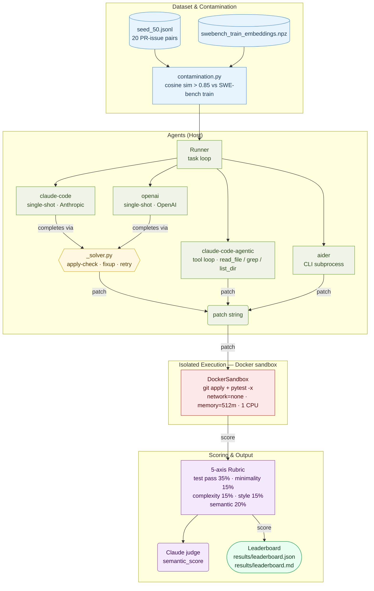

# coding-agent-eval-harness

> Reproducible, contamination-aware eval harness for coding agents. Real GitHub PR-issue pairs (20 built, expanding to 50), Docker-isolated execution, 5-axis rubric scoring, cross-agent leaderboard. Built so the benchmark can embarrass you.

[](https://github.com/SebAustin/coding-agent-eval-harness/actions/workflows/ci.yml)
[](https://www.python.org)
[](LICENSE)

## The problem with coding agent benchmarks in 2026

Every coding agent vendor quotes SWE-bench. The problems are well-documented:
models train on the test set (contamination), the benchmark only scores pass/fail
(a 3,000-line patch that passes tests scores the same as a 10-line one), and there
is no reproducible path from "run this on my tasks" to "this is what each agent
actually produced."

This repo is the answer: a harness you can run on a curated set of real GitHub
PR-issue pairs, with contamination detection, a 5-axis rubric that rewards minimal
correct diffs, and a leaderboard you can commit next to your code.

## Architecture

### At a glance

```mermaid
flowchart LR
    classDef input   fill:#e8f4fd,stroke:#4a90d9,color:#1a3a5c
    classDef agent   fill:#f0f4e8,stroke:#6a9a3a,color:#2a4a1a
    classDef sandbox fill:#fce8e8,stroke:#c0392b,color:#5a0a0a
    classDef scoring fill:#f3e8fc,stroke:#8e44ad,color:#3a0a5a
    classDef output  fill:#e8fcf0,stroke:#27ae60,color:#0a3a1a

    tasks["GitHub PR-Issues<br/>(contamination-filtered)"]:::input
    agents["Coding Agents<br/>Claude · OpenAI · Aider"]:::agent
    patch("patch"):::agent
    sandbox["Docker Sandbox<br/>git apply + pytest"]:::sandbox
    rubric["5-axis Rubric"]:::scoring
    leaderboard(["Leaderboard"]):::output

    tasks   --> agents
    agents  --> patch
    patch   -->|"isolated run"| sandbox
    sandbox -->|"score"| rubric
    rubric  --> leaderboard
```



_Contamination-filtered GitHub PR-issue tasks → coding agents emit a patch → it runs in an
isolated Docker sandbox → a 5-axis rubric scores it → results land on the leaderboard._

### Detailed pipeline



Single-shot adapters (`claude-code`, `openai`) share an identical apply-check + format-fixup + bounded-retry pipeline via `agents/_solver.py`; `claude-code-agentic` (tool loop) and `aider` (CLI subprocess) bypass the solver and emit a patch directly. Agent API calls happen entirely on the host; only the patch string crosses into the Docker sandbox.

## Quickstart

```bash
git clone https://github.com/SebAustin/coding-agent-eval-harness && cd coding-agent-eval-harness
uv sync && cp .env.example .env
make build-sandbox     # build the Docker sandbox image (~2 min)
uv run coding-eval run --agents claude-code --limit 5 --smoke
```

## The 5-axis rubric

| Axis | Weight | Measures |
|---|---|---|
| `test_pass_rate` | 35% | Fraction of existing tests passing after patch |
| `diff_minimality` | 15% | 1 − (changed_lines / 200). Rewards surgical fixes. |
| `complexity_delta` | 15% | Cyclomatic complexity before vs after (radon). Lower = better. |
| `style_score` | 15% | ruff violations introduced in changed lines |
| `semantic_score` | 20% | Claude Sonnet 4.5 judge: does the patch correctly address the issue? |

## Leaderboard (claude-code, 20-task `seed_50`)

> Measured numbers from `results/leaderboard.json` (`--seed 42`, full current
> dataset of 20 tasks). The `openai` adapter (v0.2) is available and ready to
> run — real per-task numbers require a paid run with `OPENAI_API_KEY` set; see
> the [Agents](#agents) section. Dataset expansion to 50 tasks is pending (issue
> #2). The single-shot vs `claude-code-agentic` head-to-head is reproducible via
> `make eval-compare` ([agentic comparison](docs/agentic_comparison.md);
> full-dataset numbers pending a credit window). Per-task composite varies up
> to ~0.2 between runs from agent sampling (`temperature=0` is not a seed) — see
> [methodology §Limitations](docs/methodology.md). Average over runs before
> reading rankings into single-run differences.

| Agent | Composite | Test pass | Diff min | Complexity | Style | Semantic | Cost/task | n_clean | Contam% |
|---|---:|---:|---:|---:|---:|---:|---:|---:|---:|
| Claude Code (Sonnet 4.5) | **0.60** | 0.40 | 0.82 | 0.85 | 0.80 | 0.45 | $0.092 | 20 | 0% |

*Contamination: 0/20 tasks flagged vs SWE-bench train. Of the 3 tasks scoring 0,
all are single-shot agent limits (the model needs to explore multiple files and
hallucinates context) rather than harness failures — now addressed by the
tool-using [`claude-code-agentic`](#agents) adapter. Contamination analysis
(current 20-task corpus): [`docs/contamination_analysis.md`](docs/contamination_analysis.md).*

## Agents

| ID | Strategy | Cost/task | When to use |
|---|---|---|---|
| `claude-code` | Single-shot: fixed repo-context prompt → one diff (+ apply-check retries) | ~$0.09 | Default; fast and cheap for fixes whose context fits up front. |
| `claude-code-agentic` | Tool-using: read-only `read_file`/`grep`/`list_dir` over the clone, loops until it emits an applicable diff | ~$1–2 | Multi-file fixes that need codebase exploration (e.g. a helper + its callers). |
| `openai` | Single-shot via OpenAI `gpt-4o-2024-11-20`; same apply-check + format-fixup pipeline as `claude-code` | ~$0.04–0.10 | Cross-vendor comparison; requires `OPENAI_API_KEY`. |
| `aider` | Subprocess wrapper around the `aider` CLI | — | External-tool comparison. |

```bash
# Single-shot Claude (default)
uv run coding-eval run --agents claude-code --limit 5

# Single-shot OpenAI (gpt-4o) — requires OPENAI_API_KEY in .env
uv run coding-eval run --agents openai --limit 5

# Cross-vendor comparison in one run
uv run coding-eval run --agents claude-code --agents openai --limit 5

# Tool-using agentic variant — explores the repo before patching
uv run coding-eval run --agents claude-code-agentic --tasks-file data/tasks/typer-0822.jsonl
```

**Single-shot provider comparison:** `claude-code` and `openai` share the identical
apply-check + format-fixup + bounded-retry pipeline via `agents/_solver.py`. The only
difference is the provider closure (Anthropic Messages API vs OpenAI Chat Completions API,
system prompt as kwarg vs first message). This makes per-provider score differences
attributable to model quality, not harness differences. Real per-task numbers require a
paid run with `OPENAI_API_KEY` set; the adapter is fully unit-tested offline with a mocked
client (see `tests/test_openai_adapter.py`).

The agentic adapter is bounded by `MAX_TURNS` (call count), `MAX_COST_USD` (spend),
and a per-task wall-clock timeout (`CODING_EVAL_AGENT_TIMEOUT_S`, default 600s); transient
API errors are retried with exponential backoff. Docker sandbox execution is unchanged —
only host-side patch generation gains tools.

Reproduce the single-shot vs agentic head-to-head with `make eval-compare` (renders a
per-axis delta) — see [agentic comparison](docs/agentic_comparison.md).

## Documentation

- [Methodology](docs/methodology.md) — task selection, contamination, judge model
- [Rubric design](docs/rubric_design.md) — per-axis formulas and weights
- [Contamination analysis](docs/contamination_analysis.md) — threshold and overlap stats
- [Adding agents](docs/adding_agents.md) — register a new `AgentAdapter`
- [Agentic comparison](docs/agentic_comparison.md) — reproducible single-shot vs agentic head-to-head
- [Changelog](CHANGELOG.md) — release history (v0.2.0: the `openai` adapter + shared solver)

## Sources

1. Jimenez et al. "SWE-bench: Can Language Models Resolve Real-World GitHub Issues?" ICLR 2024.
2. Cursor. "CursorBench: Measuring Agent Coding Performance with Blame-Traced Ground Truth." 2026.
3. Yang et al. "SWE-agent: Agent-Computer Interfaces Enable Automated Software Engineering." 2024.
4. Anthropic. Claude Code documentation, 2026.
5. Wortsman et al. "Model soups: averaging weights of multiple fine-tuned models improves accuracy." ICML 2022.