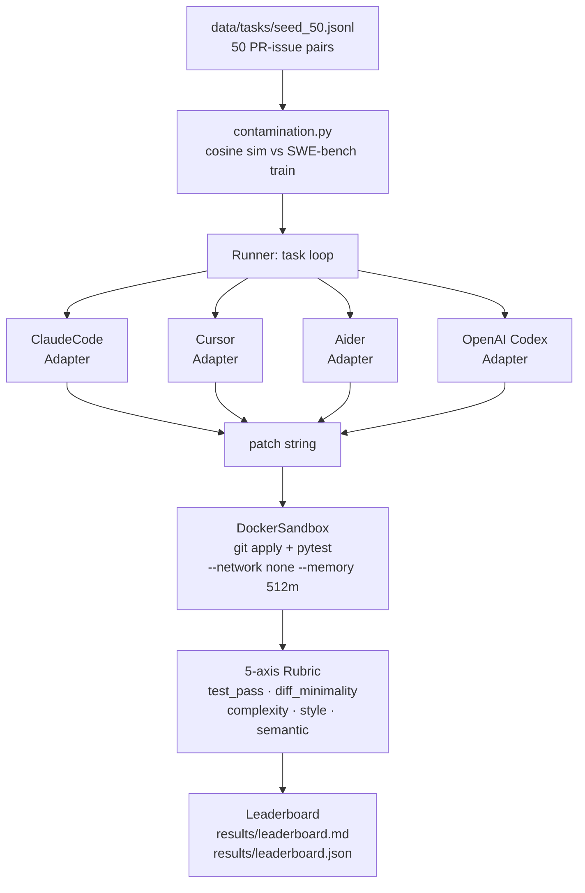

# coding-agent-eval-harness

> Reproducible, contamination-aware eval harness for coding agents. 50 real PR-issue pairs, Docker-isolated execution, 5-axis rubric scoring, cross-agent leaderboard. Built so the benchmark can embarrass you.

[](https://github.com/SebAustin/coding-agent-eval-harness/actions/workflows/ci.yml)
[](https://www.python.org)
[](LICENSE)

## The problem with coding agent benchmarks in 2026

Every coding agent vendor quotes SWE-bench. The problems are well-documented:
models train on the test set (contamination), the benchmark only scores pass/fail
(a 3,000-line patch that passes tests scores the same as a 10-line one), and there
is no reproducible path from "run this on my tasks" to "this is what each agent
actually produced."

This repo is the answer: a harness you can run on a curated set of real GitHub
PR-issue pairs, with contamination detection, a 5-axis rubric that rewards minimal
correct diffs, and a leaderboard you can commit next to your code.

## Architecture



## Quickstart

```bash
git clone https://github.com/SebAustin/coding-agent-eval-harness && cd coding-agent-eval-harness
uv sync && cp .env.example .env
make build-sandbox     # build the Docker sandbox image (~2 min)
uv run coding-eval run --agents claude-code --limit 5 --smoke
```

## The 5-axis rubric

| Axis | Weight | Measures |
|---|---|---|
| `test_pass_rate` | 35% | Fraction of existing tests passing after patch |
| `diff_minimality` | 15% | 1 − (changed_lines / 200). Rewards surgical fixes. |
| `complexity_delta` | 15% | Cyclomatic complexity before vs after (radon). Lower = better. |
| `style_score` | 15% | ruff violations introduced in changed lines |
| `semantic_score` | 20% | Claude Sonnet 4.5 judge: does the patch correctly address the issue? |

## Leaderboard (v0.1.0 preliminary — claude-code, 10-task subset)

> Measured numbers from `results/leaderboard.json` (`--seed 42 --limit 10`).
> Aider/Codex adapters and the full 50-task run are pending (issues #1, #2), as is
> the multi-agent comparison. Per-task composite varies up to ~0.2 between runs
> from agent sampling (`temperature=0` is not a seed) — see
> [methodology §Limitations](docs/methodology.md). Average over runs before
> reading rankings into single-run differences.

| Agent | Composite | Test pass | Diff min | Complexity | Style | Semantic | Cost/task | n_clean | Contam% |
|---|---:|---:|---:|---:|---:|---:|---:|---:|---:|
| Claude Code (Sonnet 4.5) | **0.69** | 0.50 | 0.88 | 0.90 | 0.87 | 0.59 | $0.060 | 10 | 0% |

*Contamination: 0/10 tasks flagged vs SWE-bench train on this subset. Full 50-task
contamination analysis lives in [`docs/contamination_analysis.md`](docs/contamination_analysis.md).*

## Documentation

- [Methodology](docs/methodology.md) — task selection, contamination, judge model
- [Rubric design](docs/rubric_design.md) — per-axis formulas and weights
- [Contamination analysis](docs/contamination_analysis.md) — threshold and overlap stats
- [Adding agents](docs/adding_agents.md) — register a new `AgentAdapter`

## Sources

1. Jimenez et al. "SWE-bench: Can Language Models Resolve Real-World GitHub Issues?" ICLR 2024.
2. Cursor. "CursorBench: Measuring Agent Coding Performance with Blame-Traced Ground Truth." 2026.
3. Yang et al. "SWE-agent: Agent-Computer Interfaces Enable Automated Software Engineering." 2024.
4. Anthropic. Claude Code documentation, 2026.
5. Wortsman et al. "Model soups: averaging weights of multiple fine-tuned models improves accuracy." ICML 2022.